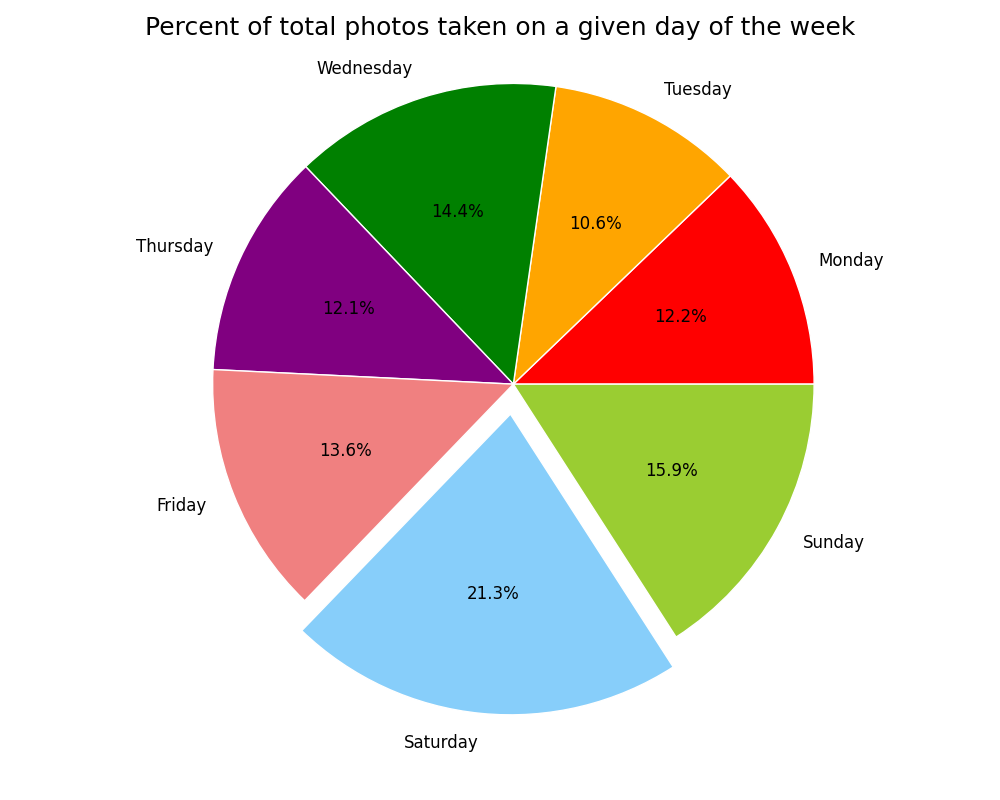
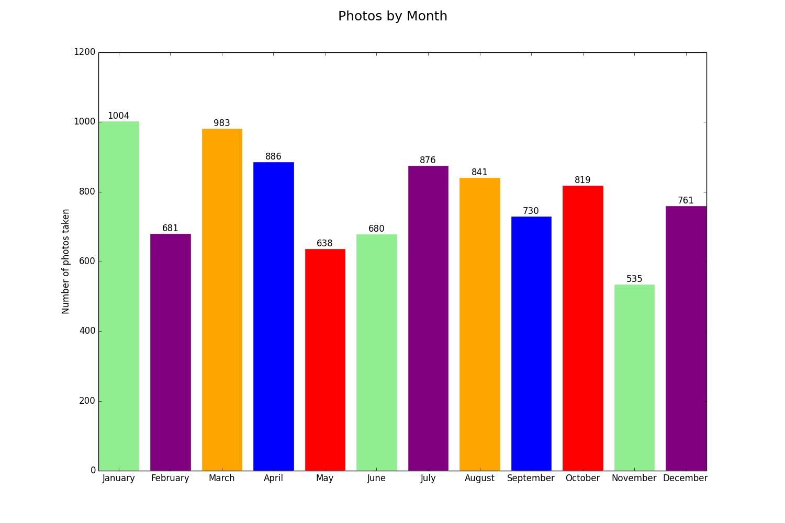
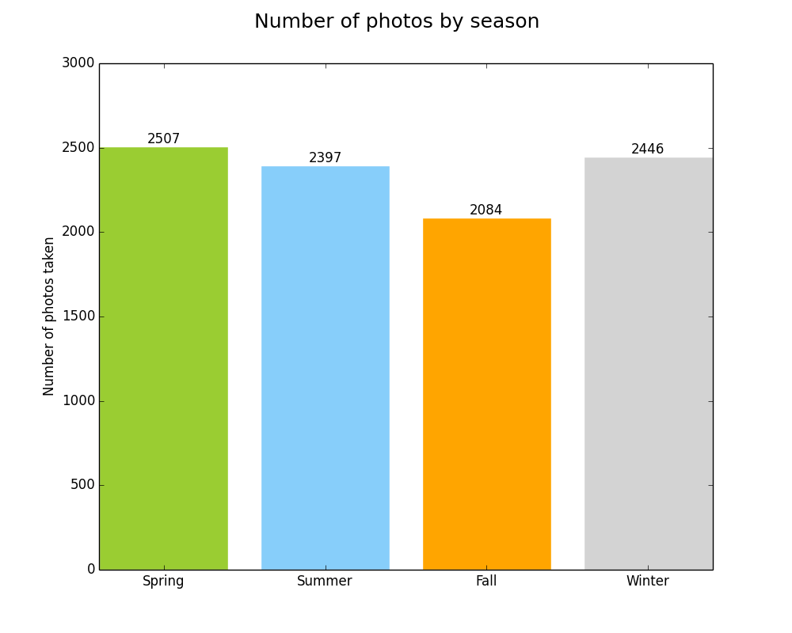
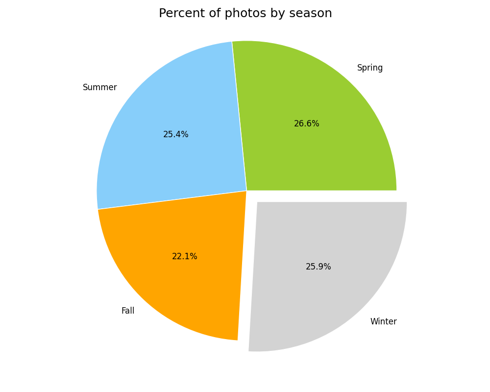
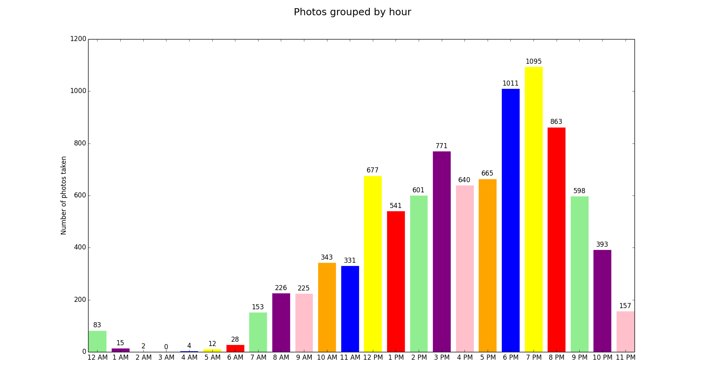

# Photos.app Date and Location Analysis
This is a personal project to apply some data science skills I've been learning. My goal was to make a project where I do everything from start to finish: Identify and create my own data set, format it, analyze it, then visualize it.

- Extracting data
  - Using AppleScript to loop through photo metadata in Photos.app and writing it to a CSV
- Getting the data in a usable format
  - Using grep to break apart the date strings into days, dates, and times
- Process/analyze the data and get insights from it
  - Process CSV files with Python
- Visualize this analysis to better convey these insights
  - D3.js
  - matplotlib

## Dependencies

1. Mac OS X (I'm using 10.11, but it should work on 10.10 and above) with the built-in [Script Editor](http://guides.macrumors.com/Script_Editor) still installed.
2. Photos inside [Photos.app](https://www.apple.com/osx/photos/), the built-in photos application on Mac OS X 10.10 and above
3. [TextWrangler](https://itunes.apple.com/us/app/textwrangler/id404010395?mt=12), a free text editor on Mac OS X
4. [Python](https://www.python.org/downloads/)

## How to use

Open `all.scpt` with `Script Editor.app`, which is usually in `Applications/Utilities`. Press "Run" or hit cmd + R. Depending on the size of your photo library, it might take anywhere from a few seconds to a few minutes. It took 37 seconds for my 8275 photos.

You'll see TextWrangler flash by for a second, then the Python script will run the counts in the background, then Preview will launch and show four charts with your data. They should look look something like this:

## The Scripts

### all.scpt

This is the AppleScript that contains the instructions for running everything from beginning to end. It runs each of the individual scripts below then launches the resulting images in Preview and Safari.

###  extract_metadata_from_photos_app.scpt
This file takes the date information from all of your photos in Photos.app on Mac OS X and writes them to a file called `photo_dates.csv` with the proper headers inside the same folder where this script is stored. 

### locations/extract_photo_locations.scpt
This file takes the location information from all of your photos in Photos.app on Mac OS X and writes them to a file called `photo_locations.csv` with the proper headers inside the same folder where this script is stored. 

### reformat_with_textwrangler.scpt
This AppleScript opens `photo_dates.csv` in TextWrangler and runs two find and replace functions to clean up the formatting of the file. TextWrangler then saves the file.

### locations/location_reformat_with_textwrangler.scpt
This AppleScript opens `photo_locations.csv` in TextWrangler and runs two find and replace functions to clean up the formatting of the file. It deletes missing values, separates lat and long with a comma, and gets rid of poorly formatted lines (no negative value for longitude). TextWrangler then saves the file and quits.

### count_days.py
This Python script reads the cleaned-up CSV, counts how many photos were taken on each of the days of the week, then uses [matplotlib](http://matplotlib.org) to make bar and pie charts out of the resulting data. These charts are then saved to the `img` folder.

### months.py
This Python script searches through the dates and organizes them by month, sums the totals, then uses [matplotlib](http://matplotlib.org) to make a bar chart out of the resulting data. This chart is then saved to the `img` folder.

### seasons.py
This Python script searches through the dates and organizes them by season, sums the totals, then uses [matplotlib](http://matplotlib.org) to make bar and pie charts out of the resulting data. These charts are then saved to the `img` folder.

### hours.py
This Python script splits the time strings and counts how many are AM vs PM, then uses [matplotlib](http://matplotlib.org) to make a pie chart out of the resulting data. This chart is saved to the `img` folder. This script also uses [regex](http://www.regular-expressions.info) to find and count the number of times a photo was taken within a given hour block and makes a bar chart out of the resulting data.

### locations/locations.html
This HTML file takes `photo_locations.csv` and plots the lat, long on a map of the US with [D3.js](http://d3js.org). The `us.json` file in that folder enables the D3.js script to draw the state boundaries.

## Assumptions and possible issues
- My photos in Photos.app come from a few different iPhones, so my processing of the metadata certainly works for that, but I don't have access to different kinds of phones, so I can't guarantee that metadata from other types of phones will pass. If you want to help me test this, get in touch!
- `photo_locations.csv` assumes that the metadata output is in the format: `lat-long`
- Most of my photos were taken in the US, so the D3.js map is centered in the US. You'll need to load other countries and change the view if you want to see your photos that were taken elsewhere.
- I've sporadically run into an error from Preview when AppleScript tries to open the generated charts that says something like "This file cannot be opened because Preview does not have permission to access it." This is sporadic and I can't consistently replicate it, so I don't know how to solve it yet. If this happens to you, dismiss the errors and manually open the files in Preview. Or simply rerun `all.scpt`.

## Privacy
None of your photo information is being transmitted anywhere. All of this is running locally on your machine and only you can see it unless you choose to share it.

## To Do
- [x] Create Python scripts to count days of the week
- [x] Break down seasons
- [x] AM vs PM 
- [x] Group hour by time of day
- [x] Put locations on a map
- [ ] Make the map more advanced with the ability to zoom, pan, or hover for date info
- [ ] [Calendar view](http://bl.ocks.org/mbostock/4063318)
- [ ] Output a text file with aggregate stats: Totals by month and year 
