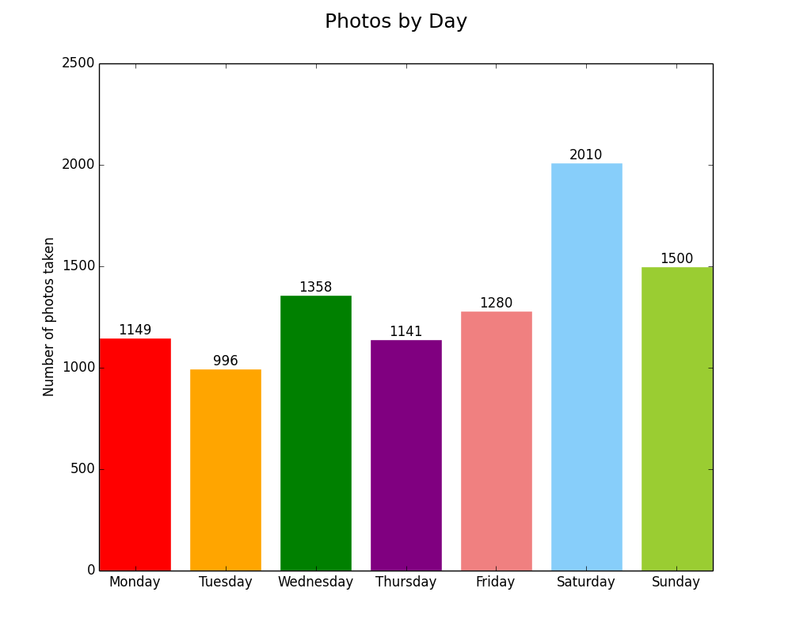

# Photos.app Date and Location Analysis
This is a personal project to apply some data science skills I've been learning. My goal was to make a project where I do everything from start to finish: Identify and create my own data set, format it, analyze it, then visualize it.

- Extracting data
  - Using AppleScript to loop through photo metadata in Photos.app and writing it to a CSV
- Getting the data in a usable format
  - Using grep to break apart the date strings into days, dates, and times
- Process/analyze the data and get insights from it
  - Process CSV files with Python
- Visualize this analysis to better convey these insights
  - D3.js
  - matplotlib

## all.scpt

This is the AppleScript that contains the instructions for running everything from beginning to end. It runs each of the individual scripts below then launches the resulting images in Preview.

### How to use

Open `all.scpt` with `Script Editor.app`, which is usually in `Applications/Utilities`. Press "Run" or hit cmd + R. Depending on the size of your photo library, it might take anywhere from a few seconds to a few minutes. It took 37 seconds for my 8275 photos.

You'll see TextWrangler flash by for a second, then the Python script will run the counts in the background, then Preview will launch and show two charts with your data. They should look look something like this:

## The Scripts

###  extract_metadata_from_photos_app.scpt
This file takes the date and location information from all of your photos in Photos.app on Mac OS X and writes them to a file called `photo_dates_location.csv` with the proper headers inside the same folder where this script is stored. 

### reformat_with_textwrangler.scpt
This AppleScript opens the CSV generated above in TextWrangler and runs two find and replace functions to clean up the formatting of the file. TextWrangler then saves the file and quits.

### count_days.py
This Python script reads the cleaned-up CSV, counts how many photos were taken on each of the days of the week, then uses [matplotlob](http://matplotlib.org) to make bar and pie charts out of the resulting data. These charts are then saved to the `img` folder.

## Dependencies

1. Mac OS X (I'm using 10.11, but it should work on 10.10 and above) with the built-in [Script Editor](http://guides.macrumors.com/Script_Editor) still installed.
2. Photos inside [Photos.app](https://www.apple.com/osx/photos/), the built-in photos application on Mac OS X 10.10 and above
3. [TextWrangler](https://itunes.apple.com/us/app/textwrangler/id404010395?mt=12), a free text editor on Mac OS X
4. [Python 2](https://www.python.org/downloads/)

## To Do
- [x] Create Python scripts to count days of the week
- [ ] Break down seasons
- [ ] Cluster time of day
- [ ] Put locations on a map